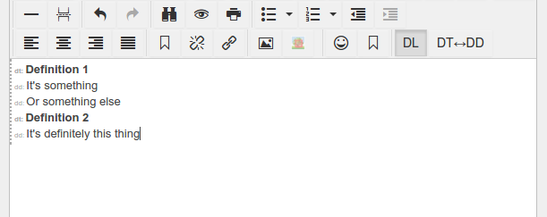

# tinymce-definitionlist

TinyMCE 4 plugin to add tools for definition lists.

Taken from https://github.com/bkalish/wordpress.plugin.definitionlist

How to install the plugin
=========================

1. copy `definitionlist` folder to the tinymce `plugins` folder.

2. set up your instance in the tinyMCE.init method to use the plugin, like::

  plugins : "... definitionlist ..."

3. set up your instance to use the buttons, for example::

  toolbar : "... | ToggleDefinitionList ToggleDefinitionItem"
